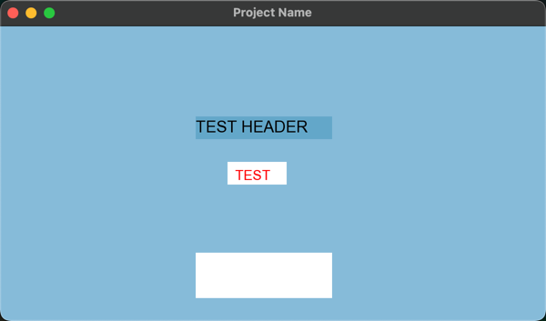

# Project Name
Project Description goes here

* operation 1
* operation 2

## Demo
* Demo 1
 

* Demo 2
   
  

## Design
change the repo name:
Can be found in [https://github.com/hanbintan2003/SFML_Template/blob/main/design.txt]

## Features

- feature 1
- feature 2
